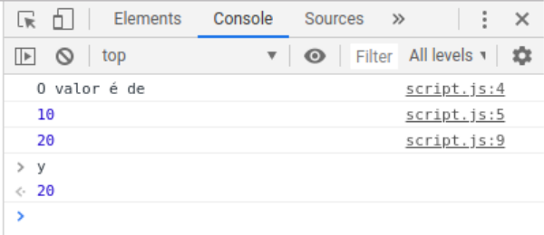
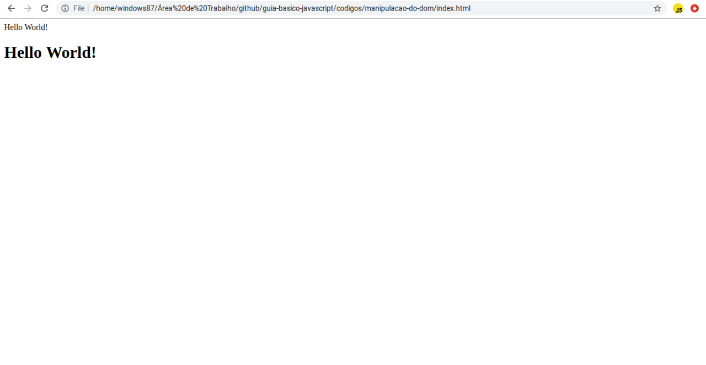
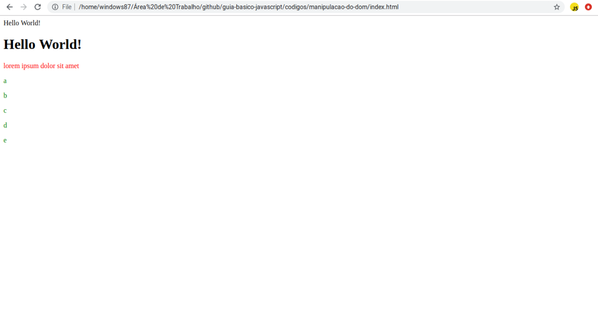
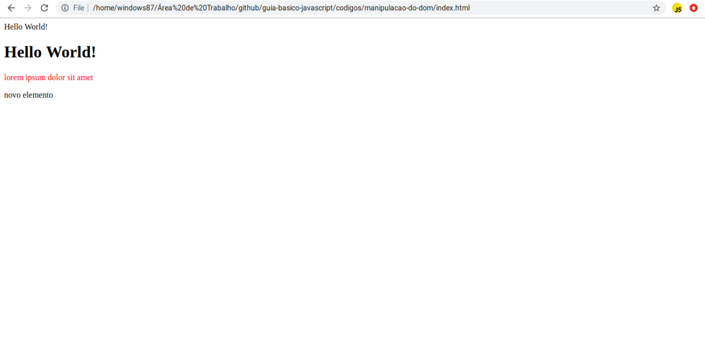

<div style="text-align: center;">
  
</div>

# Guia Básico de Javascript

## Introdução
Javascript é uma linguagem de programação que primariamente é usada em navegadores, mas pode ser utilizada em outros ambientes, como em servidores com o NodeJS, em aplicações mobile com o Ionic ou React-Native e em aplicações para desktop com Electron ou Nwjs.
{: style="text-align: justify"}

O Javascript é uma linguagem simples, com uma sintaxe parecida com outras linguagens, como o C++. A sua versão mais atual, ES2015 ou ES6+ traz novas features que tornam o Javascript mais simples, independente de frameworks como o jQuery e mais fácil para desenvolver aplicações mais complexas. O ES2015 apresenta classes, métodos de tratar funções assíncronas (async e await), Ajax nativo e facilitado (fetch) e outras features.
{: style="text-align: justify"}

O resultado final de cada tópico estará dentro da pasta códigos.
{: style="text-align: justify"}

## Conteúdo
O guia aborda os seguintes assuntos:
{: style="text-align: justify"}

- [Utilizar Javascript no HTML](#utilizar-javascript-no-html)
- [Console e Debug](#console-e-debug)
- [Variáveis, Objetos e Funções](#variaveis-objetos-e-funcoes)
	- [Variáveis](#variaveis)
	- [Objetos e Arrays](#objetos-e-arrays)
	- [Funções](#funcoes)
- [If, else, for, while e forEach](#if-else-for-while-foreach)
	- [If e Else](#if-e-else)
		- [Operadores de Comparação](#operadores-de-comparacao)
		- [Operadores Lógicos](#operadores-logicos)
	- [For, While e forEach](#for-while-e-foreach)
- [Manipulação do DOM](#manipulacao-do-dom)
	- [Modificar Elementos](#modificar-elementos)
		- [Modificar o Texto e o HTML](#modificar-o-texto-e-o-html)
		- [Modificar o Estilo do Elemento](#modificar-o-estilo-do-elemento)
		- [Modificar todos os Elementos de uma Classe ou Tag](#modificar-todos-os-elementos-de-uma-classe-ou-tag)
		- [Modificar outros Valores do Elemento](#modificar-outros-valores-do-elemento)
	- [Criar Elementos](#criar-elementos)
- [setInterval e setTimeout](#setinterval-e-settimeout)
	- [setInterval](#setinterval)
	- [setTimeout](#settimeout)
- Eventos
- Requisições HTTP (Ajax)
- LocalStorage
- O que é Node, React, Electron e Outros
{: style="text-align: justify"}

## Utilizar Javascript no HTML

Para importar o Javascript é necessário utilizar a tag `<script>`, normalmente é utilizado no fim da tag `<body>`. Para importar é necessário do parâmetro `src` linkando o arquivo Javascript, como no exemplo:
{: style="text-align: justify"}

```html
<body>
  <!-----
    Resto do Código HTML
  ------>
  <script type="text/javascript" src="script.js"></script>
</body>
```

Também é possível utilizar códigos javascript sem a necessidade de importar um arquivo javascript dentro do HTML utilizando os códigos dentro da tag `<script>`:
{: style="text-align: justify"}

```html
<body>
  <!-----
    Resto do Código HTML
  ------>
  <script type="text/javascript">
    // Código Javascript
    // Isso é um comentário
  </script>
</body>
```

O recomendado é criar um arquivo javascript separado do arquivo HTML para manter uma boa organização do código. Além disso, é recomendado também criar uma pasta para colocar todos os arquivos de scripts javascript.
{: style="text-align: justify"}

## Console e Debug
Dentro do arquivo javascript linkado no HTML, insira esse código:
{: style="text-align: justify"}

```javascript
console.log('Hello World');
```

Se atualizar a página HTML, verá que não aconteceu absolutamente nada. Mas se clicar com o botão direito do mouse e clicar em "Inspecionar" ou utilizar o atalho `Ctrl + Shift + I` e clicar na aba do console, irá ver uma mensagem:
{: style="text-align: justify"} 

<kbd>
  
</kbd>

Esse código mostra uma mensagem no console. Isso pode ser útil para tentar resolver algum bug do código. E o console também é extremamente útil para esse propósito, nele você pode ver valores de variáveis, elementos HTML e utilizar códigos de Javascript.
{: style="text-align: justify"} 

Tente trocar o texto do console ou adicionar mais textos para visualizar dentro do console.
{: style="text-align: justify"} 

## Variáveis, Objetos e Funções

### Variáveis
Diferente de outras linguagens, o Javascript apresenta apenas dois tipos de variáveis, o tipo `const`, que é uma variável constante, ou seja, seu valor não pode mudar, e o tipo `let`, que é uma variável que o valor pode ser modificado. Não é necessário escrever o tipo da variável (string, int) como no C++ ou Java. Exemplo:
{: style="text-align: justify"}

```javascript
const x = "O valor é de";
let y = 10;

console.log(x);
console.log(y);

y = 20;

console.log(y);
```

Ao atualizar a página e ver o console, será possível ver a saída com os valores das variáveis. Como disse, é possível ver o valor de uma variável pelo console, apenas digite o nome da variável e aperte enter. Resultado:
{: style="text-align: justify"}

<kbd>
  
</kbd>

Para se concatenar variáveis, existem dois métodos:

```javascript
console.log(x + " " + y);
console.log(`${x} ${y}`);
```

### Objetos e Arrays
Objetos são tipos de variáveis que podem armazenar vários tipos de dados, que podem ser modificados, como o seguinte exemplo:
{: style="text-align: justify"}

```javascript
const pessoa = {
  nome: 'Terry',
  sobrenome: 'Martin',
  idade: 38
};

console.log(`Olá ${pessoa.nome} ${pessoa.sobrenome}, sua idade é de ${pessoa.idade}`);

pessoa.idade = 39;

console.log(`Olá ${pessoa.nome}, sua nova idade é ${pessoa.idade}`);
```

Arrays são listas, que começam com a posição zero. Para se acessar o valor de um array se usa o `array[posicao]` e para adicionar novos valores aos arrays, é utilizado a função `.push(valorDaVariavel)`. Exemplo de código:
{: style="text-align: justify"}

```javascript
const alfabeto = ['a', 'b', 'c', 'd', 'e'];

console.log(`Segunda letra do alfabeto: ${alfabeto[1]}`);

console.log('Array do Alfabeto:');
console.log(alfabeto);

alfabeto.push('f');

console.log('Array do Alfabeto depois do Push:');
console.log(alfabeto);
```

### Funções
Diferente do C++ ou Java, não é necessário declarar o retorno. Existem dois métodos de declarar funções:
{: style="text-align: justify"}

```javascript
function funcao() {
  console.log('olá');
}

const segundaFuncao = () => {
  console.log('olá');
}

function funcaoComParametro(nome) {
  console.log(`olá ${nome}`);
}
```

E para executar a função, coloque o nome da função acompanhada de `()` e se a função necessitar parâmetros, passe os valores divididos por vírgula, igual em outras linguagens:
{: style="text-align: justify"}

```javascript
funcao();
segundaFuncao();
funcaoComParametro('Terry');
```

Para retornar valores, utilize o comando `return`, exemplo:
{: style="text-align: justify"}

```javascript
function soma(x, y) {
  return x + y;
}

console.log(soma(10, 5)); // 15
```


Tente declarar novas variáveis, objetos e arrays e procurar e utilizar novas funções de Arrays por meio da documentação do Javascript, como de remover o último elemento da lista ou cortar parte do array:
https://developer.mozilla.org/pt-BR/docs/Web/JavaScript/Reference/Global_Objects/Array.
{: style="text-align: justify"}

## If, else, for, while e forEach
Os comandos de seleção e laços de repetição do Javascript são semelhantes aos de outras linguagens, como C/C++ e Java. 
{: style="text-align: justify"}

### If e Else
O `if` e `else`, igual ao C++, quando apresenta apenas uma linha, não é necessário utilizar das chaves, como no exemplo:
{: style="text-align: justify"}

```javascript
const x = 10;

if(x > 10)
  console.log('Maior que 10');
else if (x == 10)
  console.log('Igual a 10');
else
  console.log('Menor que 10');
```

O `else if` no código é o mesmo que o `else if` do C++. se o primeiro `if` estiver errado, seguirá até os outros `else if`s até um funcionar e parar a seleção. Se nenhum funcionar, entrará no `else`.

Mas quando é necessário um bloco de código, é necessário utilizar chaves, como no exemplo:
{: style="text-align: justify"}

```javascript
const senha = 'abc123';

if(senha === 'abc123') {
  console.log('Senha Correta!');
  console.log('Entrando no Sistema..');
} else {
  console.log('Senha Inválida.');
}
```

#### Operadores de Comparação
Segue uma tabela de operadores de comparação, como igual, maior ou igual igual aos do C++.
{: style="text-align: justify"}

| Operador     | Nome                   |
|--------------|------------------------|
| `==`         | Igual                  |
| `!=`         | Diferente              |
| `===`        | Igual Estritamente     |
| `!==`        | Diferente Estritamente |
| `>`          | Maior que              |
| `>=`         | Maior ou igual que     |
| `<`          | Menor que              |
| `<=`         | Menor ou igual que     |

A diferença do Igual e Igual Estritamente é que o Igual não compara tipos, ou seja, `3 == "3"` dá `true`, mas o Igual Estritamente daria `false`, mas daria `true` com a comparação `3 === 3`. Exemplos:
{: style="text-align: justify"}

```javascript
const a = 10;
const b = '10';
const c = 20;

console.log(a == b); // true
console.log(a === b); // false

console.log(a != b); // false
console.log(a !== b); // true

console.log(a > c); // false
console.log(a < c); // true
console.log(a >= b); // true
```

#### Operadores Lógicos
Segue uma tabela de operadores lógicos, iguais ao do C++.
{: style="text-align: justify"}

| Operador     | Nome     |
|--------------|----------|
| `&&`         | e        |
| `||`         | ou       |
| `!`          | inversor |

Exemplos:
{: style="text-align: justify"}

```javascript
const y = 10;
const z = 20;
const p = true;

console.log(y === 10 && z > 10); // true
console.log(y === 10 && z < 10); // false

console.log(y === 10 || z > 10); // true
console.log(y === 10 || z < 10); // true

console.log(!p); // false
console.log(!!p); // true
```

### For, While e ForEach
Os laços de repetição são também iguais do C++, o novo é o `forEach`, que é uma função nova dos arrays, junto com o `map` e `filter`. Exemplos:
{: style="text-align: justify"}

```javascript
for(let i = 0; i < 10; i++)
  console.log(`Numero ${i}`);

let i = 0;
while(i < 10) {
  console.log(`Numero ${i}`);
  i++;
}

let array = ['a', 'b', 'c', 'd', 'e'];

array.forEach(letra => {
  console.log(letra);
});
```

O `for` e o `while` tem saídas iguais, dando um output de 0 a 9. O `forEach` imprime todos os valores do array no console.
{: style="text-align: justify"}

## Manipulação do DOM
Até agora foi passado apenas os fundamentos do Javascript. A parte interessante do Javascript é manipular o DOM, ou seja, manipular os elementos da página.
{: style="text-align: justify"}

Com o Javascript é possível modificar o texto e o HTML de elementos, modificar o estilo de um elemento, modificar o source de uma imagem, modificar as classes de um elemento ou criar um novo elemento pelo código. Ou seja, é possível modificar todas as propriedades da página.
{: style="text-align: justify"}

### Modificar Elementos

#### Modificar o Texto e o HTML
Primeiramente, para modificar um elemento, é necessário selecionar o elemento que você quer modificar e guardar em uma variável. Utilizamos a função `document.querySelector()` para selecionar apenas um elemento utilizando seletores CSS. Por exemplo, para pegar um elemento com o id `elemento`, seria usado `document.querySelector('#elemento')`, mas se fosse uma classe, seria utilizado `document.querySelector('.elemento')`. Mas como classes podem ser usadas em mais de um elemento, o querySelector retornaria apenas o primeiro elemento encontrado com essa classe.
{: style="text-align: justify"}

Para modificar o texto, se utiliza a propriedade `innerText` do elemento. Exemplo de modificação de texto de uma `div`:
{: style="text-align: justify"}

**HTML**:
```html
<!----
  Resto do Código HTML
----->
<div id="elemento">
</div>
<!----
  Resto do Código HTML
----->
```

**Javascript**:
```javascript
const elemento = document.querySelector('#elemento');
elemento.innerText = 'Hello World!';
```

Como pode ser visto, apareceu a palavra "Hello World" na página. Mas caso quisessemos mostrar o "Hello World" como elemento `h1`, podemos utilizar o `innerHTML` para modificar todo o HTML dentro do elemento.
{: style="text-align: justify"}

**HTML**:
```html
<!----
  Resto do Código HTML
----->
<div id="elemento-2">
</div>
<!----
  Resto do Código HTML
----->
```

**Javascript**:
```javascript
const elemento2 = document.querySelector('#elemento-2');
elemento2.innerHTML = '<h1>Hello World!</h1>';
```

**Resultado**:
{: style="text-align: justify"}

<kbd>
  
</kbd>

#### Modificar o Estilo do Elemento
Para modificar o estilo, você pode utilizar a propriedade `elemento.style['nomeDaPropriedadeCSS'] = 'valorDaPrpriedade';`. Para modificar a cor de um parágrafo, seria usado esses códigos:
{: style="text-align: justify"}

**HTML**:
```html
<!----
  Resto do Código HTML
----->
<p id="elemento-3">
  lorem ipsum dolor sit amet
</p>
<!----
  Resto do Código HTML
----->
```

**Javascript**:
```javascript
const elemento3 = document.querySelector('#elemento-3');
elemento3.style['color'] = 'red';
```

**Resultado**:
{: style="text-align: justify"}

<kbd>
  
</kbd>

Também é possível adicionar uma classe utilizando a função `elemento.classList.add('nomeDaClasse');` para editar o CSS.
{: style="text-align: justify"}

#### Modificar todos os Elementos de uma Classe ou Tag
A função `document.querySelectorAll('nomeDaClasseOuTag')` seleciona todos os elementos de uma classe ou tag e retorna um array, então, para modificar todos os elementos é necessário modificar os elementos um por um. Por isso pode ser utilizado o `forEach` mostrado acima. Exemplo:
{: style="text-align: justify"}

**HTML**:
```html
<!----
  Resto do Código HTML
----->
<p class="classe">a</p>
<p class="classe">b</p>
<p class="classe">c</p>
<p class="classe">d</p>
<p class="classe">e</p>
<!----
  Resto do Código HTML
----->
```

**Javascript**:
```javascript
const elementos = document.querySelectorAll('.classe');

elementos.forEach(elemento => {
  elemento.style['color'] = 'green';
});
```

**Resultado**:
{: style="text-align: justify"}

<kbd>
  
</kbd>

#### Modificar outros Valores do Elemento
Como dito, é possível modificar outros valores do elemento, como a source de uma imagem: `img.src = 'linkDaImagem'` ou o valor de um input: `input.value = 'valorDoInput'`.
{: style="text-align: justify"}

### Criar Elementos
Mas modificar elementos é muito limitado. Por isso, é possível criar elementos por meio do javascript utilizando a função `novoElemento = document.createElement('tipoDeElemento')`, mas para o elemento aparecer na página é necessário adicionar dentro de um elemento pai com a função `elementoPai.appendChild(novoElemento)`. Exemplo:
{: style="text-align: justify"}

```javascript
const novoElemento = document.createElement('div');
const body = document.querySelector('body');

novoElemento.innerText = 'novo elemento';

body.appendChild(novoElemento);
```

O exemplo mostra a criação de um novo elemento, a seleção do elemento pai, que no caso é o elemento `body`, a modificação do texto do novo elemento e a adição dele no `body`. Todos os elementos podem serem criados, como `img` e `p`.
{: style="text-align: justify"}

Resultado:
{: style="text-align: justify"}

<kbd>
  
</kbd>

## setInterval e setTimeout
Essas duas funções são funções de tempo. O setInterval é uma função que executa a cada x milisegundos (1s = 1000ms) até você parar esse código. já o setTimeout espera x milisegundos e executa.
{: style="text-align: justify"}

### setInterval
A função abaixo modifica o elemento a cada segundo:
{: style="text-align: justify"}

**HTML**:
```html
<!----
  Resto do Código HTML
----->
<p id="elemento">0</p>
<!----
  Resto do Código HTML
----->
```

**Javascript**:
```javascript
let i = 1;

function modificarElemento() {
  const elemento = document.querySelector('#elemento');
  novoElemento.innerText = i;
  i++;
}

setInterval(modificarElemento, 1000);
```

### setTimeout
A função abaixo cria um elemento depois de cinco segundos:
{: style="text-align: justify"}

```javascript
function criarElemento() {
  const novoElemento = document.createElement('p');
  const body = document.querySelector('body');

  novoElemento.innerText = 'Elemento';
  body.appendChild(novoElemento);

  i++;
}

setTimeout(criarElemento, 5000);
```